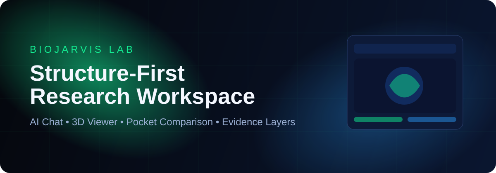
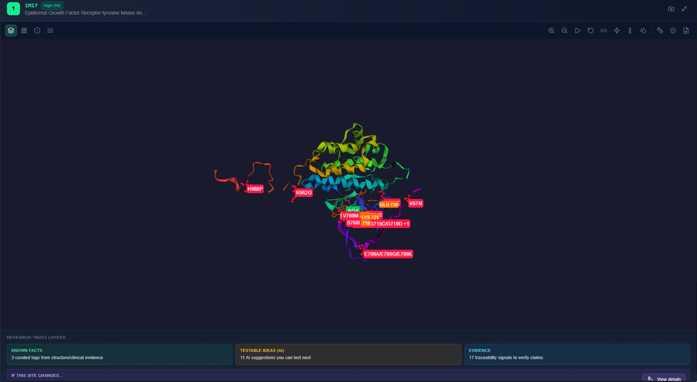
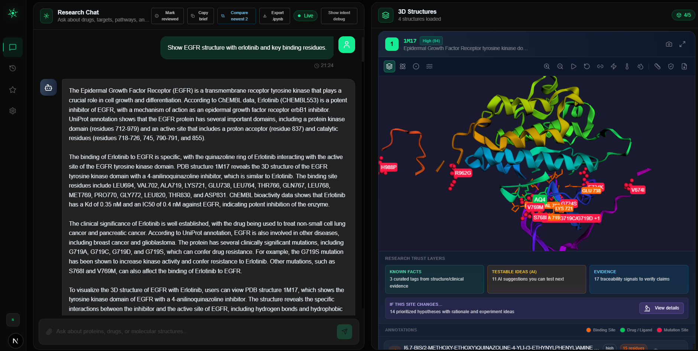
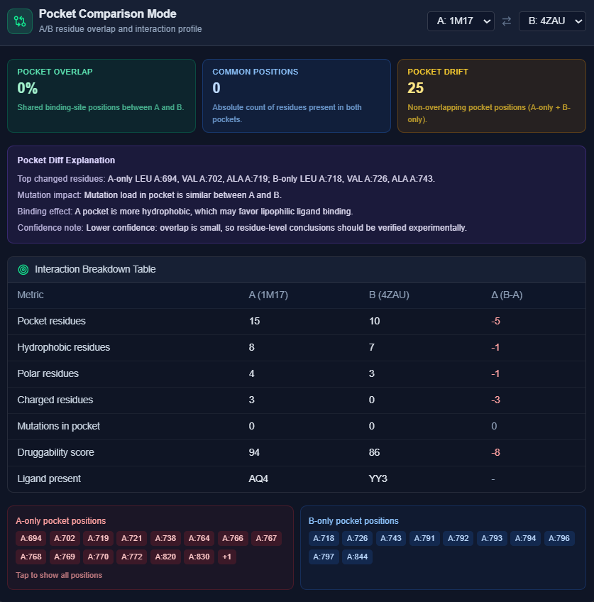
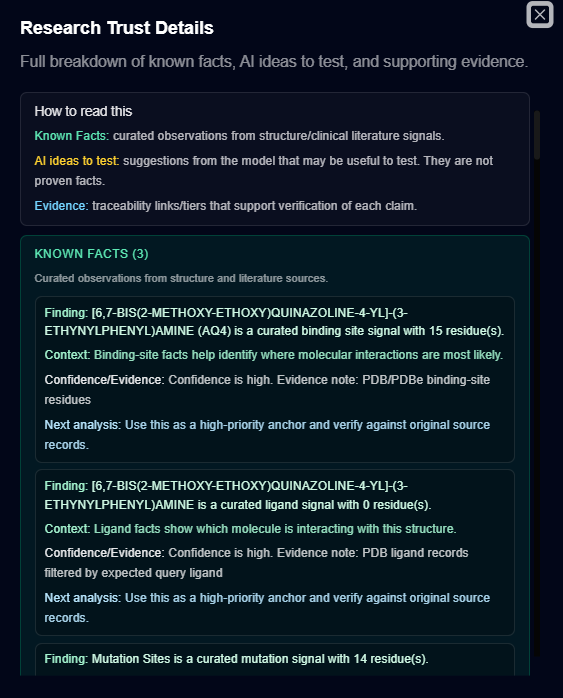

# 🧬 BioJarvis Lab

<p align="center">
  
</p>

<p align="center">
  <strong>Structure-first AI for molecular research.</strong>
</p>

<p align="center">
  <a href="https://nextjs.org/"></a>
  <a href="https://www.typescriptlang.org/"></a>
  <a href="https://supabase.com/"></a>
  
</p>

BioJarvis helps researchers move from **question → structure → evidence** in one interface. It combines conversational research, 3D molecular analysis, pocket comparison, and evidence-aware trust layers.

**Links:** [Product Walkthrough](#product-walkthrough) · [Quick Start](#quick-start) · [How It Works](#how-it-works-short) · [Feature Status](#feature-status) · [OAuth Setup](#google--github-oauth-setup)

> **Try in 2 minutes:** Add `.env.local` → run `npm install` → run `npm run dev`.

<p>
  <a href="#quick-start"></a>
  <a href="#product-walkthrough"></a>
</p>

---

## Highlights

- **Research copilot with memory** — multi-turn scientific Q&A with context continuity.
- **Structure intelligence** — interactive 3D viewer with mutation and site annotations.
- **Pocket-level reasoning** — overlap/drift deltas and interaction summaries.
- **Trust-first output** — separates facts, testable ideas, and evidence trails.
- **Team-ready output** — notebook export (`.ipynb`), favorites, history, and collaboration briefs.

---

## Demo Flow

1. Ask a question about a target/mutation in chat.
2. Open structure mode and inspect residues + pocket deltas.
3. Validate decision quality using facts/hypotheses/evidence layers.

---

## Product Walkthrough

<table>
  <tr>
    <td width="50%" valign="top">
      <h3>1) Ask in natural language</h3>
      <p>Start from a biological question and keep follow-up context intact across turns.</p>
      
    </td>
    <td width="50%" valign="top">
      <h3>2) Inspect in fullscreen 3D</h3>
      <p>Switch to structure mode, inspect residues, and reason around mutation impact.</p>
      
    </td>
  </tr>
  <tr>
    <td width="50%" valign="top">
      <h3>3) Compare changes quickly</h3>
      <p>Use analysis panels to interpret overlap, drift, and interaction differences.</p>
      
    </td>
    <td width="50%" valign="top">
      <h3>4) Validate with evidence</h3>
      <p>Review confidence and provenance before sharing conclusions.</p>
      
    </td>
  </tr>
</table>

---

## How It Works (short)

```text
Research Question
      │
      ▼
┌──────────────────────────────┐
│      Intent Router           │
│ text_only / structure_needed │
└──────────────┬───────────────┘
               │
     ┌─────────┴─────────┐
     ▼                   ▼
Text response       3D structure pipeline
     │                   │
     └─────────┬─────────┘
               ▼
      Trust + Evidence Layers
               │
               ▼
         Research Decision
```

---

## Everything Built So Far

### Core research workflow
- Conversational Q&A with follow-up memory
- Intent routing between text and structure workflows
- Confidence signals, policy flags, and provenance traces

### Structure & pocket analysis
- Interactive 3D structure viewer
- Mutation and binding-site annotations
- Pocket comparison (overlap, drift, A/B unique residues)
- Interaction deltas (hydrophobic/polar/charged)

### Trust & explainability
- Trust layers: **Known Facts**, **Testable Ideas**, **Evidence**
- Research card progression: Finding → Context → Confidence → Next analysis
- Drilldown-ready evidence panels

### Productivity & collaboration
- Query history and favorites
- Notebook export (`.ipynb`)
- Shareable collaboration brief
- Upload parsing (`.csv`, `.txt`, `.tsv`, `.json`) with mutation extraction

### Ops & guardrails
- Supabase auth: email/password + Google/GitHub OAuth
- Daily usage tracking
- Accuracy and drift benchmark scripts

---

## Feature Status

| Capability | Status | Notes |
|---|---|---|
| Research Chat + Follow-up Memory | ✅ Implemented | Multi-turn continuity + intent routing |
| 3D Structure Viewer | ✅ Implemented | Mutation/site annotations |
| Pocket Comparison | ✅ Implemented | Overlap, drift, interaction deltas |
| Trust Layers + Evidence UI | ✅ Implemented | Fact/hypothesis/evidence separation |
| OAuth (Google/GitHub) | ✅ Implemented | Provider credentials required in Supabase |
| Export + Collaboration | ✅ Implemented | `.ipynb` export + collaboration brief |
| Evidence Tier Filtering | 🚧 In Progress | Planned deeper filtering controls |
| Potency Snapshot Blocks | 🚧 In Progress | Planned faster medicinal chemistry scan |
| Multi-model fallback orchestration | 🚧 In Progress | Planned reliability/latency balancing |

---

## Quick Start

Runtime: **Node.js 20+** recommended.

### 1) Install

```bash
npm install
```

### 2) Create environment file

Create `.env.local` in the project root with:

```env
NEXT_PUBLIC_SUPABASE_URL=...
NEXT_PUBLIC_SUPABASE_ANON_KEY=...
SUPABASE_SERVICE_ROLE_KEY=...
GROQ_API_KEY=...
```

### 3) Start development server

```bash
npm run dev
```

Open: `http://localhost:3000`

---

## Scripts

```bash
npm run dev
npm run lint
npm run build
npm run benchmark:accuracy
npm run benchmark:question-types
npm run benchmark:drift
npm run benchmark:guard
```

---

## Google + GitHub OAuth Setup

The auth UI is already wired; configure providers in Supabase.

### Supabase URL configuration
- Site URL:
  - `http://localhost:3000` (local)
  - `https://your-domain.com` (prod)
- Redirect URLs:
  - `http://localhost:3000/auth/callback`
  - `https://your-domain.com/auth/callback`

### Google OAuth
- Create OAuth Web client in Google Cloud Console
- Use callback URI:
  - `https://<SUPABASE_PROJECT_REF>.supabase.co/auth/v1/callback`
- Add client ID/secret in Supabase → Auth → Providers → Google

### GitHub OAuth
- Create OAuth App in GitHub Developer Settings
- Set authorization callback URL:
  - `https://<SUPABASE_PROJECT_REF>.supabase.co/auth/v1/callback`
- Add client ID/secret in Supabase → Auth → Providers → GitHub

---

## Deployment

### Vercel / Netlify
1. Push repository
2. Import project
3. Add environment variables
4. Deploy
5. Add production callback URLs in Supabase auth settings

### Optional strict evidence mode

```env
BIOJARVIS_STRICT_EVIDENCE_POLICY=true
```

When enabled, answers are policy-guarded when primary curated evidence is missing.

---

## Tech Stack

- **Frontend:** Next.js (App Router), React, TypeScript
- **UI:** Tailwind CSS + shadcn/ui
- **Backend:** Supabase (Auth + Postgres)
- **Data integrations:** PDB, ChEMBL, UniProt, PubMed (MCP-style clients)

---

## Contributing

1. Fork the repository
2. Create a feature branch
3. Make focused changes
4. Open a pull request

---

## Acknowledgments

- Anthropic
- Supabase
- 3Dmol.js
- RCSB PDB
- ChEMBL
- UniProt
- PubMed

---

<div align="center">
Built for research velocity, scientific rigor, and explainable decisions.
</div>
