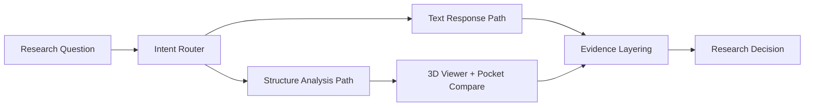

# 🧬 BioJarvis Lab

<div align="center">


### A research copilot for molecular science teams

Ask in plain language, inspect structures in 3D, compare pockets, and validate conclusions with evidence layers.


</div>

---

## ✨ Product Walkthrough

<table>
  <tr>
    <td width="50%" valign="top">
      <h3>1) Start with the research question</h3>
      <p>Ask about targets, mutations, compounds, or mechanisms. Follow-up context is preserved and routed automatically.</p>
      
    </td>
    <td width="50%" valign="top">
      <h3>2) Move into structure-first analysis</h3>
      <p>Open fullscreen 3D view, inspect residues and mutation positions, and focus on pocket-level interpretation.</p>
      
    </td>
  </tr>
  <tr>
    <td width="50%" valign="top">
      <h3>3) Understand what changed</h3>
      <p>Use analysis panels to evaluate overlap, drift, and interaction deltas for practical medicinal chemistry reasoning.</p>
      
    </td>
    <td width="50%" valign="top">
      <h3>4) Decide with evidence layers</h3>
      <p>Review facts, testable ideas, and evidence traces before sharing recommendations.</p>
      
    </td>
  </tr>
</table>

---

## 🧠 How BioJarvis Works



---

## ⚡ At A Glance

- **Question to structure in one flow:** chat, routing, and 3D inspection stay connected
- **Pocket-level interpretation:** compare overlap, drift, and interaction changes quickly
- **Evidence-first decisions:** separate known facts from hypotheses and supporting traces
- **Team-ready outputs:** export notebooks, keep history, and share concise research briefs

---

## 🚀 Core Capabilities

### Research Copilot
- Natural-language Q&A for targets, pathways, compounds, and mechanisms
- Follow-up memory across turns
- Intent routing between `text_only` and `structure_required`
- Confidence metadata, policy flags, and source traces

### Structure Intelligence
- Interactive 3D viewer with mutation and binding-site annotations
- Pocket comparison with overlap, drift, and A/B unique residues
- Interaction metric summaries (hydrophobic, polar, charged deltas)
- Fullscreen analysis and structure-only screenshot export

### Explainability & Trust
- Trust layers: Known Facts, Testable Ideas, Evidence
- Research card flow: Finding → Context → Confidence/Evidence → Next analysis
- Provenance drill-down for verification-first workflows

### Team Productivity
- Chat history and favorites for repeatable workflows
- Notebook export (`.ipynb`) and collaboration brief copy
- Dataset upload (`.csv`, `.txt`, `.tsv`, `.json`) with mutation extraction
- Usage tracking and quota guardrails

---

## 🧭 Feature Status

| Capability | Status | Details |
|---|---|---|
| Research Chat + Follow-up Memory | ✅ Implemented | Multi-turn continuity and intent routing |
| 3D Structure Viewer | ✅ Implemented | Mutation + site annotations |
| Pocket Comparison | ✅ Implemented | Overlap, drift, interaction deltas |
| Trust Layers + Evidence UI | ✅ Implemented | Fact/hypothesis/evidence separation |
| OAuth (Google/GitHub) | ✅ Implemented | Requires provider credentials in Supabase |
| Export & Collaboration | ✅ Implemented | `.ipynb` export + copy brief |
| Evidence Filtering by Tier | 🚧 In Progress | Planned advanced filter controls |
| Potency Snapshot Blocks | 🚧 In Progress | Planned faster medicinal chemistry scan |
| Multi-model fallback orchestration | 🚧 In Progress | Planned reliability/latency balancing |

---

## 👥 Built For

- **Researchers:** structure-grounded interpretation with evidence traceability
- **Students:** a clear path from question → explanation → confidence
- **Drug discovery teams:** faster handoffs through notebooks, history, and shareable briefs

---

## 🛠 Tech Stack

- **Frontend:** Next.js (App Router), React, TypeScript
- **UI:** Tailwind CSS + shadcn/ui primitives
- **Backend:** Supabase (Auth + Postgres)
- **Data Integrations:** PDB, ChEMBL, UniProt, PubMed (MCP-style clients)

---

## 🚀 Quick Start

### 1) Install dependencies

```bash
npm install
```

### 2) Configure environment

```bash
cp .env.local.example .env.local
```

Required environment variables:

```env
NEXT_PUBLIC_SUPABASE_URL=...
NEXT_PUBLIC_SUPABASE_ANON_KEY=...
SUPABASE_SERVICE_ROLE_KEY=...
GROQ_API_KEY=...
```

### 3) Run locally

```bash
npm run dev
```

Open `http://localhost:3000`

---

## 🔐 Google + GitHub OAuth Setup

Auth UI is already wired. Only provider configuration is required.

### Supabase URL Configuration
- **Site URL**
  - Local: `http://localhost:3000`
  - Prod: `https://your-domain.com`
- **Redirect URLs**
  - `http://localhost:3000/auth/callback`
  - `https://your-domain.com/auth/callback`

### Google OAuth
- Create OAuth Web client in Google Cloud Console
- Redirect URI:
  - `https://<SUPABASE_PROJECT_REF>.supabase.co/auth/v1/callback`
- Copy Client ID/Secret into Supabase → Auth → Providers → Google

### GitHub OAuth
- Create OAuth App in GitHub Developer Settings
- Authorization callback URL:
  - `https://<SUPABASE_PROJECT_REF>.supabase.co/auth/v1/callback`
- Copy Client ID/Secret into Supabase → Auth → Providers → GitHub

---

## 📜 Scripts

```bash
npm run dev
npm run lint
npm run build
npm run benchmark:accuracy
npm run benchmark:question-types
npm run benchmark:guard
```

---

## 📦 Deployment

### Vercel / Netlify
1. Push repo
2. Import project
3. Add environment variables
4. Deploy
5. Add production callback URLs in Supabase Auth settings

### Optional strict evidence mode

```env
BIOJARVIS_STRICT_EVIDENCE_POLICY=true
```

When enabled, responses are policy-guarded when primary curated evidence is missing.

---

## 🤝 Contributing

1. Fork repository
2. Create feature branch
3. Make focused changes
4. Open pull request

---

## 🙏 Acknowledgments

- Anthropic
- Supabase
- 3Dmol.js
- RCSB PDB
- ChEMBL
- UniProt
- PubMed

---

<div align="center">
Built for research velocity, scientific rigor, and explainable decision-making.
</div>
